# [Instalar GCP SDK](https://cloud.google.com/sdk/install)
# [Inicializar SDK](https://cloud.google.com/sdk/docs/initializing?hl=es-419)

```
gcloud init
```
Sigue las instrucciones.

Todos los proyectos estan configurados en la region __us-west1__ y en la zona __us-west1-a__, si la consola no te lo solicita puedes configurarlo manualmente:

```
gcloud config set compute/region us-west1
gcloud config set compute/zone us-west1-a
```

Revisa tu configuración: 
```
gcloud config list
```
_ _ _

# Despliegue BA2
## 1. Crear Cluster en GKE. 
Crea un cluster zonal en __us-west1-a__, el numero de nodos y el tipo de instancia de cada uno de estos, debe ser coherente con la carga de trabajo que recibira.


## 2. Crear IPs estaticas.
Es importante que se utilicen Ips estaticas para no  tener que actualizarlas en los DNS en caso de que cambien.

```
gcloud compute addresses create ba2-tutorial-users-ip --region us-west1
gcloud compute addresses create ba2-tutorial-sso-ip --region us-west1
gcloud compute addresses create ba2-tutorial-dispatchapp-ip --region us-west1
gcloud compute addresses create ba2-tutorial-busassist-web-ip --region us-west1
gcloud compute addresses create ba2-tutorial-postgres-ip --region us-west1
gcloud compute addresses create ba2-tutorial-mongodb-users-ip --region us-west1                  
```

Revisa las IPs creadas: 
```
gcloud compute addresses describe ba2-tutorial-users-ip --region us-west1         
gcloud compute addresses describe ba2-tutorial-sso-ip --region us-west1           
gcloud compute addresses describe ba2-tutorial-dispatchapp-ip --region us-west1   
gcloud compute addresses describe ba2-tutorial-busassist-web-ip --region us-west1 
gcloud compute addresses describe ba2-tutorial-postgres-ip --region us-west1      
gcloud compute addresses describe ba2-tutorial-mongodb-users-ip --region us-west1 
```
## 3. Configura los services.yaml
Este paso es igual para los services de todas las apps de ba2. 


## 4. Desencripta los secrets.yaml.enc
Los archivos estan encriptaos con el servicio [KMS](https://cloud.google.com/kms/docs/quickstart). El llavero y las llaves deben estar creadas previamente.

```
gcloud kms keyrings create ba2-tutorial --location global
gcloud kms keys create cluster --location global --keyring ba2-tutorial --purpose encryption
```

Navega al path donde se encuentra el archivo y ejecuta:

```
gcloud kms decrypt --plaintext-file=secret.yaml --ciphertext-file=secret.yaml.enc --location=global --keyring=ba2-tutorial   --key=cluster
```

Para encriptar un archivo:
```
gcloud kms encrypt --plaintext-file=secret.yaml --ciphertext-file=secret.yaml.enc --location=global --keyring=ba2-tutorial   --key=cluster
```

## 5. [Instalar kubectl](https://cloud.google.com/kubernetes-engine/docs/quickstart) 

```
gcloud components install kubectl
```

Verifica la instalación:
```
kubectl version
```
## 6. Conectate al cluster

```
gcloud container clusters get-credentials cluster-tutorial
```

Verifica tu conexión:
```
kubectl config get-contexts
```


## 7. Desplegar Bases de Datos
Antes de desplegar las bases de datos, debes crear el namespace donde se desplegaran.

```
kubectl create namespace databases
```

### 7.1 MongoDB Users
Ubicate en el path __~/mongo-users/__ 

```
kubectl apply -f secret.yaml
kubectl apply -f pv.yaml
kubectl apply -f mongo.yaml
```
Verifica el despliegue:

```
kubectl get deployment -n databases
kubectl get service -n databases
```

Prueba tu conexión: 
El usuario y la contraseña se encuentran en el archivo secrets.yaml, estan codificados en base64, para poder ver los valores usa:

```
echo stringEnviromentVariablebase64 | base64 -d
```

CX STRING:
```
mongodb://<user>:<password>@<ip>:<port>/admin
```


### 7.2 PostgresSQL Users
Ubicate en el path __~/postgresSQL/__

```
kubectl apply -f secret.yaml
kubectl apply -f pv.yaml
kubectl apply -f service.yaml
kubectl apply -f deployment.yaml
```

Verifica el despliegue:

```
kubectl get deployment -n databases
kubectl get service -n databases
```

Prueba tu conexión: 
El usuario y la contraseña se encuentran en el archivo secrets.yaml, estan codificados en base64, para poder ver los valores usa:

```
echo stringEnviromentVariablebase64 | base64 -d
```

CX STRING:
```
postgresql://<user>:<password>@<ip>:<port>
```

### 7.3 [Crear Cluster MongoDB Atlas Producción](https://docs.atlas.mongodb.com/getting-started/)

Para conceptos de este tutorial, no se creo un nuevo cluster, se utilizo uno ya existente. 

Para migrar sigue las instrucciones:

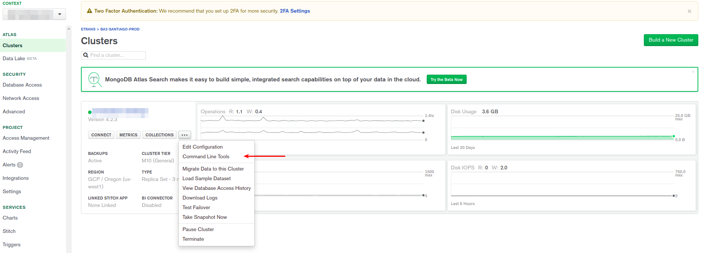


## 8. Migrar MongoDB Users
Antes de realizar la migración, hay que forzar el downgrade de versión de mongo. El Deployment esta configurado con la versión 3.4 la cual no es compatible con el schema de BD (versión 2.6). Se realizarón pruebas sin exito utilizando otras versiones de mongo. El downgrade es a la versión 3.0.

```
mongo mongodb://<user>:<password>@<ip>:<port>/admin
use admin
db.grantRolesToUser("admin", ["__system", "root"])
db.system.version.remove({})
db.system.version.insert({ "_id" : "authSchema", "currentVersion" : 3 })
```

Comando utilizado para el dump:

```
mongodump --host <ip>:<port> --username <user> --password <password> --authenticationDatabase <authDatabase> --db <database>
```

Comando utilizado para el restore:

```
mongorestore --host <ip>:<port> --username <user> --password <password> --authenticationDatabase <authDatabase>
```

Una vez realizado el restore, cambiate a la base de datos de usuario y crea el usuario que se utilizara como variable de entorno en el despliegue de las aplicaciones.

```
mongo mongodb://<user>:<password>@<ip>:<port>/admin
use <database>
db.createUser( { user: "<user>", pwd: "<password>", roles: [ { role: "readWrite", db: "<database>" } ] } )
```

## 9. Sube las images Docker al registry de Google.
Puedes descargar las imagenes del registry de transit (dockerhub) o del registry de GCP. Para descargar imagenes del registry de GCP debes estar conectado al proyecto del cual las quieres descargar, para este ejemplo, me conecte al proyecto __busassist2-264414__ que corresponde a Santiago Prod GCP.

```
docker pull gcr.io/busassist2-264414/busassist-web:2.0.0
docker pull gcr.io/busassist2-264414/dispatchapp:2.0.0
docker pull gcr.io/busassist2-264414/sso:2.0.0 
docker pull gcr.io/busassist2-264414/users:2.0.0 
```

Luego cambia el tag por el proyecto correspondiente, en este caso __busassist-tutorial__.
```
docker tag gcr.io/busassist2-264414/busassist-web:2.0.0 gcr.io/busassist-tutorial/busassist-web:2.0.0
docker tag gcr.io/busassist2-264414/dispatchapp:2.0.0 gcr.io/busassist-tutorial/dispatchapp:2.0.0
docker tag gcr.io/busassist2-264414/sso:2.0.0 gcr.io/busassist-tutorial/sso:2.0.0
docker tag gcr.io/busassist2-264414/users:2.0.0 gcr.io/busassist-tutorial/users:2.0.0
```

Sube las imagenes al registry de GCP. 
```
docker push gcr.io/busassist-tutorial/busassist-web:2.0.0
docker push gcr.io/busassist-tutorial/dispatchapp:2.0.0
docker push gcr.io/busassist-tutorial/sso:2.0.0
docker push gcr.io/busassist-tutorial/users:2.0.0
```


## 10. Desplegar Aplicaciones

Antes de desplegar, desbes configurar las variables de entorno. En los archivos secrets.yaml, debes utilizar las variables codificadas en base64. 

```
echo stringEnviromentVariable | base64
```

La especificación de las variblaes de entorno se encuentra en cada repositorio, para este turorial, solo se cambiaron las variables de entorno relacionadas a las URL de los sitios y sus respectivas conexiones a las bases de datos. 

- [SSO](https://github.com/transituc/TransitUC-SSO/tree/new-infrastructure)
- [USERS](https://github.com/transituc/TransitUC-Users/tree/development)
- [DISPATCHAPP](https://github.com/transituc/BusAssist-Dispatchapp)
- [BUSASSIS-WEB](https://github.com/transituc/BusAssist-Web)

Al momento de referenciar la URL, utiliza la siguiente nomenclatura:

__http://x.x.x.x/__

Esto con el fin de que el redireccionamiento no falle. En un paso posterior se indicara como configurar el DNS.


La documentación, indica que codificando con __echo | base64__ debería funcionar, pero al hacerlo de esta forma no se reconocen las variables, a pesar de que al decodificarlas muestre el valor correcto, quizas sea por configuracion de la consola. Para resolver este problema utilice esta [pagina](https://www.base64encode.org/) para encode y decode.

En los archivos deployment.yaml, debes cambiar el nombre de la imagen Docker por las que subiste al registry del proyecto, para cada una de las aplicaciones. 


### 10.1 SSO

Ubicate en el path __~/sso/__

```
kubectl apply -f secret.yaml
kubectl apply -f service.yaml
kubectl apply -f deployment.yaml
```

Corrobora el estado del despliegue:
```
kubectl get deployments
kubectl get services
```

__La aplicación desplegada NO estara disponible para su uso aun, porque depende de la migración de postgres, que se explicara en un paso posterior, al ingresar al IP configurado mostrara el siguiente mensaje:__


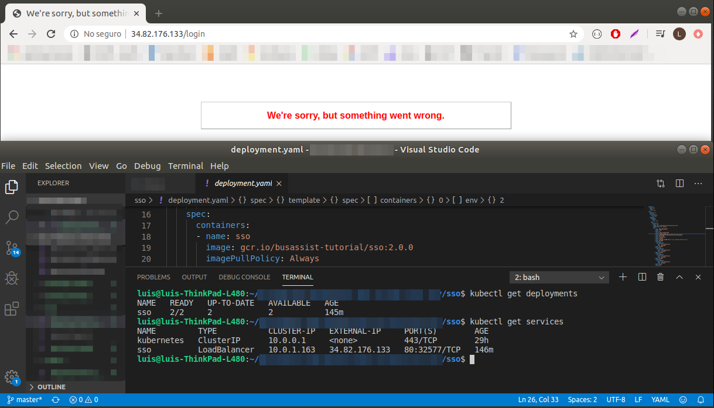


### 10.2 USERS

Ubicate en el path __~/users/__

```
kubectl apply -f secret.yaml
kubectl apply -f service.yaml
kubectl apply -f deployment.yaml
```

Corrobora el estado del despliegue:
```
kubectl get deployments
kubectl get services
```

__La aplicacion desplegada NO funcionara hasta la migración de postgres.__

Puedes corroborar esta informacion revisando los logs de la app. 
```
kubectl get pods
kubectl logs <podName>
```
### 10.3 DISPATCHAPP


Ubicate en el path __~/dispatchapp/__

```
kubectl apply -f secret.yaml
kubectl apply -f service.yaml
kubectl apply -f deployment.yaml
```

Corrobora el estado del despliegue:
```
kubectl get deployments
kubectl get services
```

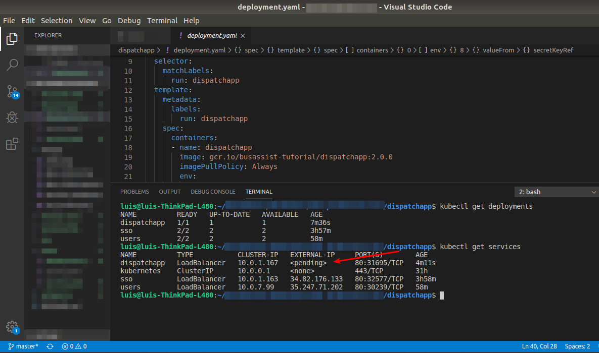

Como se ve en la imagen, la IP que estamos utilizando no logra asignarse al service que que se desplego. Para obtener mas información:

```
kubectl describe services <servicesName>
```

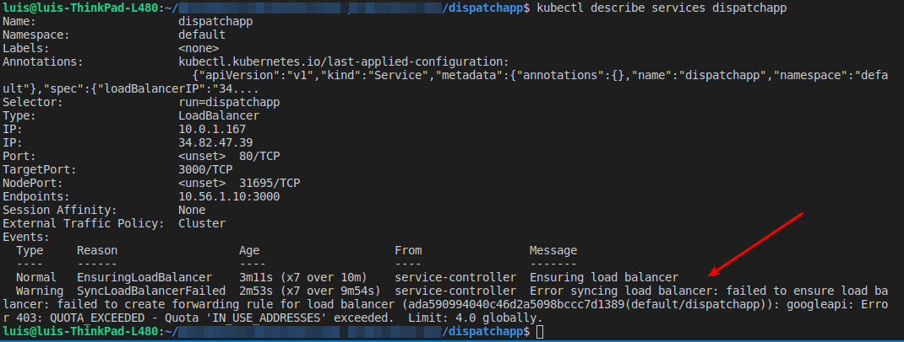

Para resolver este problema, debes extender la quota en la consola de Google. 

__Tip:__ Click en la columna __Current Usage__ para mostrar las que estan en uso. 


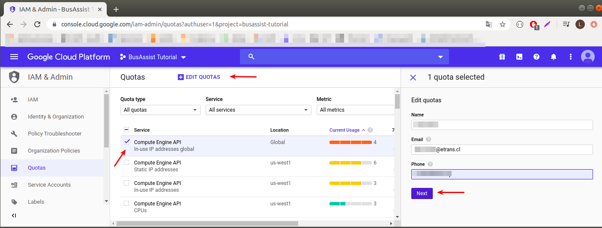


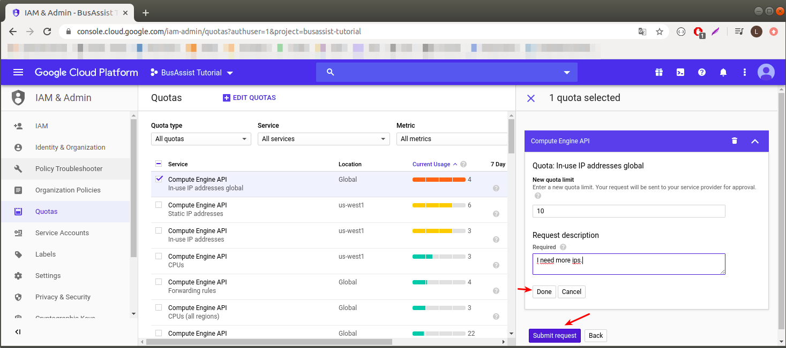

Te va a llegar un correo con el requerimiento y en unos minutos llegara un segundo correo confirmando que la quota se ha extendido. 

Corrobora el estado del despliegue: 
```
kubectl get services
```

Si el status continua en __pending__ puedes eliminar el servicio y volver a desplegarlo. 

```
kubectl delete services <serviceName>
kubectl apply -f service.yaml
```

__La aplicacion desplegada te redirigira al login del SSO que aun no esta disponible.__


### 10.4 BUASSIST-WEB

Ubicate en el path __~/busassist-web/__

```
kubectl apply -f secret.yaml
kubectl apply -f service.yaml
kubectl apply -f deployment.yaml
```

__La aplicacion desplegada te redirigira al login del SSO que aun no esta disponible.__

## 11. Migrar Postgres

Para ejecutar la migracion del schema postgres, primero debes acceder a un pod del __sso__.

```
kubectl get pods
kubectl exec -ti <ssoPodName> bash
bundle exec rake db:migrate
exit
```

__Con esto las aplicaciones ya estan preparadas para funcionar. Si por alguna razon, la migracion de postgres falla, puedes realizarla manualmente conectandote con un cliente Postgres y ejecutando el [script](https://github.com/transituc/TransitUC-Users/tree/development) de creación de la bd.__

## 12. Verifica el despliegue: 

```
kubectl get services 
```

Accede a la IP de cada App. 

Las credenciales para acceder al sitio las puedes encontrar [aquí](https://github.com/transituc/BusAssist-Web/wiki/Credenciales-para-BusAssist).

Para este tutorial se utiizo un backup de Santiago PROD. 

## 13. Configura el DNS para cada App.
Los pasos para configurar el DNS son simimilares en todas las plataformas, por organización en GCP, cada proyecto tiene su configuración para __Cloud DNS__. Para este tutorial, se utilizaron configuraciones existentes. 

__Importante: La propagación del DNS puede tardar varios minutos, por lo que si tratas de acceder inmediatamente, te saldra un error.__

### 13.1 En AWS -> Route53 
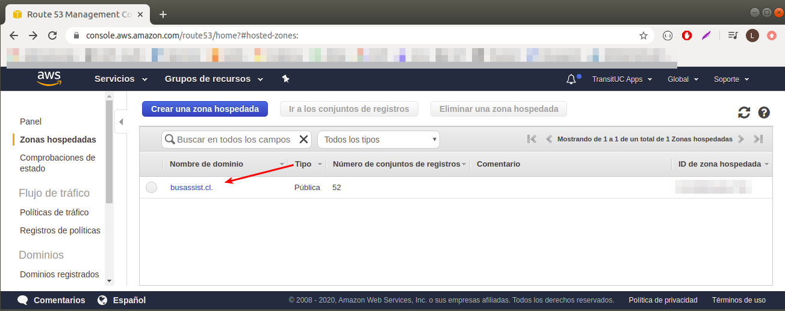

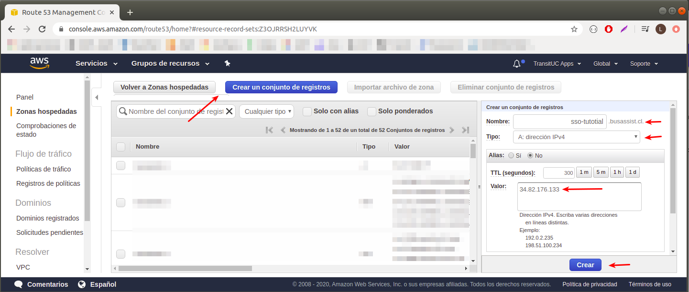

### 13.2 En GCP -> Cloud DNS.

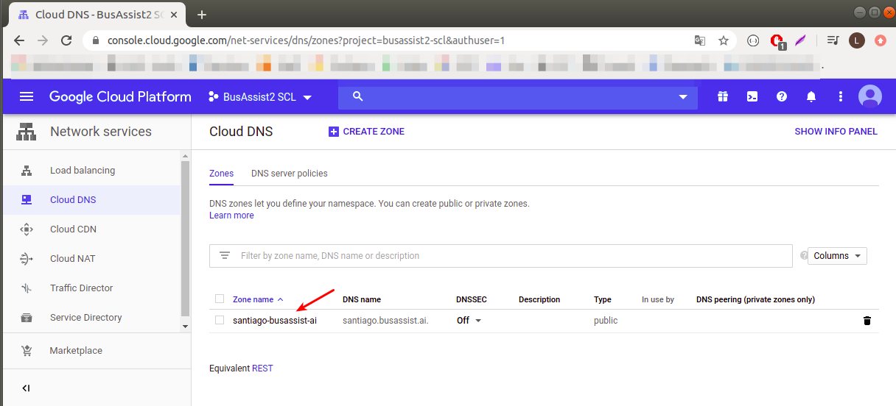
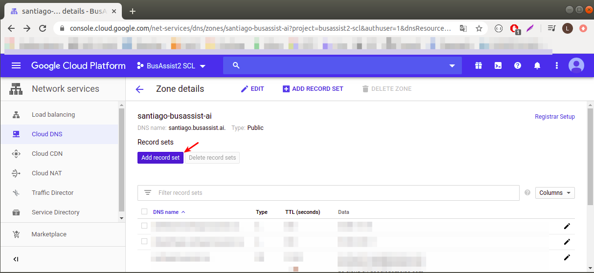
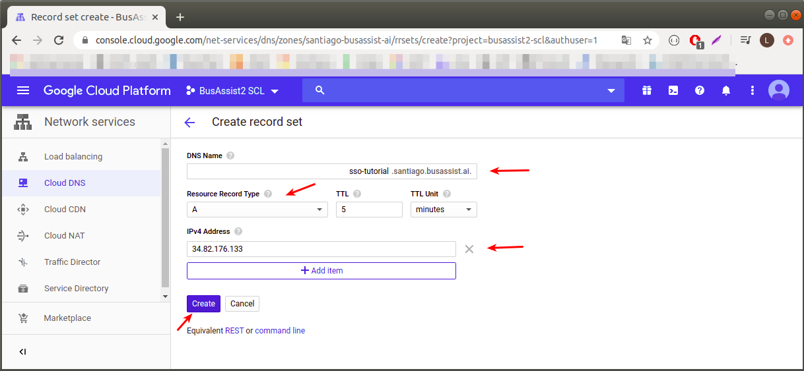

Repetir los pasos para cada App.

__Finalmente vuelve a actualizar las variables de entorno, y aplica los cambios.__

```
kubectl apply -f ~/<appName>/deployment.yaml
```
<p align="center">
  
</p>
